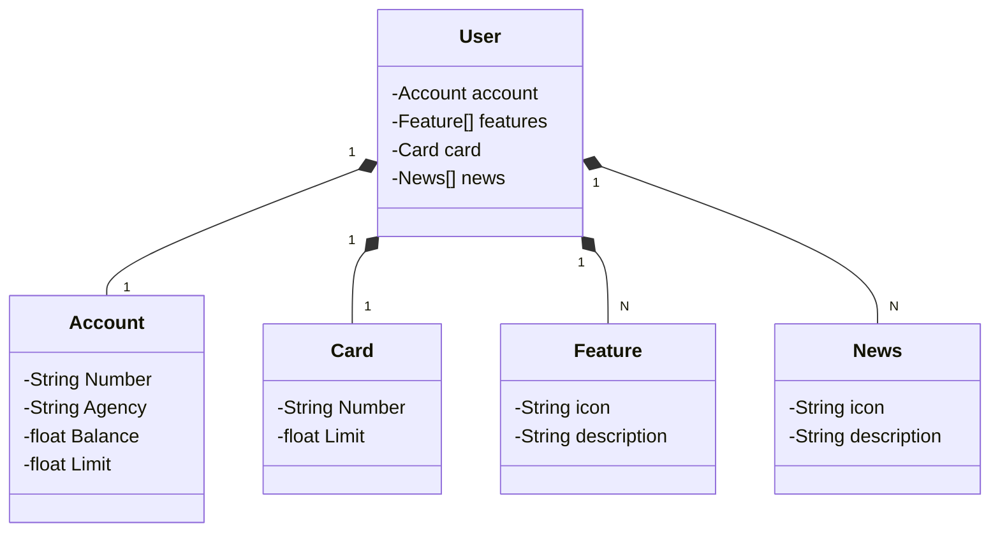

# API RESTful na Nuvem
Java RESTful API criado para desafio final.

## Diagrama de Classes

```mermaid
classDiagram
    class User {
        -Account account
        -Feature[] features
        -Card card
        -News[] news
    }

    class Account {
        -String Number
        -String Agency
        -float Balance
        -float Limit
    }

    class Feature {
        -String icon
        -String description
    }

    class Card {
        -String Number
        -float Limit
    }

    class News {
        -String icon
        -String description
    }

    User "1" *-- "1" Account
    User "1" *-- "1" Card
    User "1" *-- "N" Feature
    User "1" *-- "N" News
```
